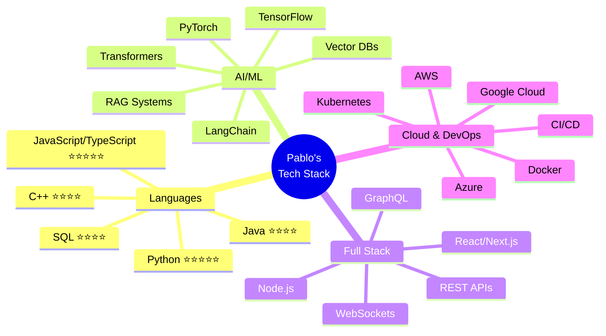
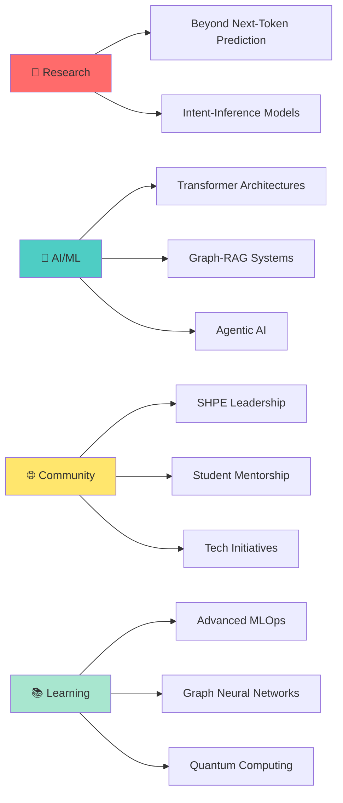

<div align="center">

# Hi there, I'm Pablo Leyva! 👋


<p align="center">
  <a href="https://linkedin.com/in/pablo-leyva"></a>
  <a href="https://pabloleyva.io"></a>
  <a href="mailto:pleyva2004@gmail.com"></a>
  
</p>

</div>

<br/>

## 🚀 About Me

<table>
<tr>
<td width="50%">

I'm a passionate **Applied Mathematics & Computer Science** student at NJIT with a focus on **AI/ML** and **data science**. Currently conducting research on **Beyond Next-Token Prediction** paradigms for Large Language Models, while leading impactful community organizations.

### 🎯 Quick Facts

```yaml
current_focus:
  - Novel LLM architectures (intent-inference over next-token prediction)
  - Advanced transformer architectures & Graph-RAG systems
  - Model Context Protocol (MCP) implementation

collaboration:
  - AI/ML projects
  - Hackathons & competitions
  - Community tech initiatives

achievements:
  - Raised $70K for student organization
  - Led 100+ students to national conferences
  - 2x increase in student internship placements
```

</td>
<td width="50%">

### 📫 Let's Connect!

[](mailto:pleyva2004@gmail.com)
[](https://linkedin.com/in/pablo-leyva)
[](https://pabloleyva.io)

### 💬 Ask Me About

<p>


</p>

### 🌱 Currently Learning

- Advanced MLOps & Model Deployment
- Graph Neural Networks (GNNs)
- Quantum Computing Applications
- Agentic AI Systems

</td>
</tr>
</table>

## 💼 Experience

<details open>
<summary><b>🍎 Apple - AIML Product Engineering Intern</b> (Summer 2025)</summary>

<br/>

**Impact:** Led cutting-edge AI/ML product development for Apple Pay

```diff
+ Led team of 3 interns building MVP for Agentic Payment flow
+ Prototyped LLM-based product recommendation workflows with Apple Pay integration
+ Implemented Model Context Protocol (MCP) for merchant catalog parsing (TypeScript)
+ Designed Graph-RAG architecture for partner-facing ChatBot
```

**Tech Stack:** `TypeScript` `LLM APIs` `MCP` `Graph-RAG` `Vector Databases`

</details>

<details open>
<summary><b>🚜 Caterpillar Inc. - Software Engineering Intern</b> (Summer 2024)</summary>

<br/>

**Impact:** Optimized SDLC using AI-powered analytics and automation

```diff
+ Analyzed software development efficiency using Generative AI
+ Built data visualization dashboards for quality metrics tracking
+ Improved team productivity through Agile & DevOps best practices
+ Automated code commit assessment and sprint velocity tracking
```

**Tech Stack:** `Python` `Generative AI` `Agile` `DevOps` `Data Visualization`

</details>

## 🏆 Featured Projects

<div align="center">

| Project | Description | Tech Stack | Highlights |
|---------|-------------|------------|------------|
| 🧠 **[subliminal-research](https://github.com/pleyva2004/subliminal-research)** | Subliminal Learning: Replication & Mechanism Probes | `PyTorch` `torch.func` `NumPy` `SciPy` | Reproduces noise-only trait transfer (**0.222** same-init vs **0.122** cross-init); 3 pre-registered hypotheses, 25-seed CIs |
| 📜 **[scholastic-llm](https://github.com/pleyva2004/scholastic-llm)** | LoRA Fine-Tune for Scholastic Argumentation | `MLX` `Qwen 2.5 7B` `LoRA` `DPO` `Claude API` | **4 adapters published** on Hugging Face; best checkpoint 68/120 strict; DPO logged as a clean negative result |
| ⚙️ **[augustine](https://github.com/pleyva2004/augustine)** | Local AI Agent Daemon with a Frozen Wire Protocol | `Python 3.13` `Starlette` `WebSocket` `SQLite` | JSON-RPC 2.0 contract **never changed** across the build; 3 model backends, zero vendor SDKs |
| 📐 **[first-principles-to-llms](https://github.com/pleyva2004/first-principles-to-llms)** | Set Theory → Transformers → RLHF, Fully Derived | `LaTeX` `PyTorch` `MLX` `Jupyter` | **34 chapters** in 3 auto-synchronized forms; definition → theorem → proof → code throughout |

</div>

---

### 🧠 subliminal-research - Does a Trait Survive Distillation on Pure Noise?

<table>
<tr>
<td width="60%">

**What it does:**
A controlled testbed for *subliminal learning* — the claim that a student distilled on a teacher's outputs over **semantically unrelated** data still inherits the teacher's trait. Reproduces the effect on MNIST, then probes the mechanism.

**Verified baseline (M = 25 seeds):**
- 🎯 Teacher accuracy **0.944**, chance **0.10**
- ✅ Same-init student on pure noise: **0.222**
- ❌ Cross-init student on pure noise: **0.122**
- 📐 Weight-update alignment η_cos: **0.254** vs **0.029**

**Three pre-registered hypotheses:**
- **H1** — tangent-space geometry vs. semantic overlap
- **H2** — smooth continuum vs. hard threshold as inits diverge
- **H3** — bandwidth ceiling vs. sample complexity

**The honest headline:**
> None of the three favored hypotheses earned a clean confirmation — **and that is the finding.** H1's pre-registered falsifier was actually met, pointing away from the geometry story; the remaining confound is flagged in the writeup rather than buried.

Predictions committed to `docs/PREDICTIONS.md` *before* any run, plus a 31-item adversarial code-verification pass.

</td>
<td width="40%">

```python
# Distillation on noise, not MNIST
out = student(bx)[:, :, idx]          # [M,B,L]
with t.no_grad():
    tgt = teacher(bx)[:, :, idx] * teacher_temp

if mode == "soft":
    loss = F.kl_div(
        F.log_softmax(out, -1),
        F.softmax(tgt, -1),
        reduction="batchmean",
    )
# bx is random noise — the student never
# sees a single real digit.
```

**Shared architecture:**

```yaml
mlp:      [784, 256, 256, 13]
logits:   10 real + 3 ghost
seeds:    25 (for CIs)
device:   mps -> cuda -> cpu
```

**Tech Stack:**


📄 Ships `FINALPAPER.pdf`, an executive summary, and a literature review.

</td>
</tr>
</table>

---

### 📜 scholastic-llm - Teaching Qwen to Argue Like Aquinas

<table>
<tr>
<td width="40%">

**Evaluation (own rubric):**

| Adapter | Strict | Balanced |
|---------|--------|----------|
| `sft-v1` | — | — |
| **`sft-v2-iter400`** | **68/120** | **68/90** |
| `sft-v2` | — | — |
| `dpo-v3` | 64/120 | 63/90 |

**The negative result:**

```yaml
finding: >
  DPO gave no improvement over SFT
  due to preference saturation —
  chosen and rejected samples came
  from the same model family.
status: reported, not hidden
```

**Tech Stack:**


</td>
<td width="60%">

**What it does:**
Fine-tunes **Qwen 2.5 7B-Instruct** with LoRA (via MLX on Apple Silicon) to answer philosophy and theology questions in a scholastic, Latin-inflected register with citations — a study in **register transfer**, not a doctrinal authority.

**The pipeline:**
```
scrape primary texts  →  clean
   ↓  (Catechism, Summa Theologica,
       Confessions, City of God)
generate pairs w/ Claude as teacher
   ↓
convert to MLX Q8  →  LoRA SFT
   ↓
rubric eval  →  optional DPO
```

**What shipped:**
- 🤗 **Four LoRA adapters** published on Hugging Face
- 🎛️ Live Gradio demo on a Hugging Face Space
- 📄 arXiv-style paper **and** conference poster, auto-rendered by GitHub Actions on every push
- 🔬 A `post-experiments/` directory of follow-up probes (content-test, layer-frame, math-test), each with its own `FINDINGS.md`

**Status:** Complete through Phase 2 (scaled SFT + DPO experiment).

</td>
</tr>
</table>

---

### ⚙️ augustine - An Agent Harness Built From the Protocol Up

<table>
<tr>
<td width="60%">

**What it does:**
A from-scratch agent harness. A local daemon runs the full **context → model → stream → tools** loop and exposes it over a versioned **JSON-RPC 2.0 / WebSocket** contract; the terminal UI and browser UI are just two clients of that same protocol.

**Design decisions worth defending:**
- 📜 The wire contract (`schema/wire-v0.json`) was frozen up front — and **did not change once** across the entire build
- 🔌 Ollama, OpenAI, and Anthropic backends implemented directly on `httpx` — **no vendor SDKs**
- 🧱 `import-linter` enforces ports/adapters in CI: `protocol` and `ports` are *forbidden* from importing any vendor package
- 🎯 Retrieval-based **skill selection** scopes each turn to a subset of tools before the model is called (falling back to the full set if scoping would unlock nothing)
- 💾 Sessions persist to SQLite (WAL) + per-session JSONL transcripts, and replay across a daemon restart

**Quality gates:** `ruff`, `pyright --strict`, `import-linter`, and `pytest` all run in CI.

**Status:** self-labeled **v0.1 — shipped**. A working prototype with an architecture designed to be extended, not a maintained product.

</td>
<td width="40%">

```python
# The agent turn loop, capped at 8 iters
async def run_agent_turn(
    adapter, registry, messages, emit, *,
    selector=None,
):
    tools = registry.specs() if registry else None
    if selector and tools:
        messages, tools = await _apply_skill_selection(
            selector, messages, tools
        )
    for _ in range(_MAX_TOOL_ITERS):  # = 8
        async for ev in adapter.stream(messages, tools):
            if isinstance(ev, TextChunk):
                await emit(TokenEvent(text=ev.text))
            elif isinstance(ev, ToolCallRequest):
                tool_calls.append(ev)
        if not tool_calls:
            await emit(DoneEvent(reason="complete"))
            return
```

**Tech Stack:**


</td>
</tr>
</table>

---

### 📐 first-principles-to-llms - Nothing Assumed, Everything Derived

<table>
<tr>
<td width="40%">

```latex
% Every chapter, same contract:
\begin{definition} ... \end{definition}
\begin{theorem}    ... \end{theorem}
\begin{proof}      ... \end{proof}
% ...then runnable code.
```

**The 9 blocks:**

```yaml
01. Foundations       # sets, proofs
02. Probability & Info
03. Stochastic Optimization
04. Neural Networks
05. Attention & Transformers
06. Pre-training
07. Post-training     # SFT, RLHF, DPO
08. RL                # MDPs -> GRPO
09. Inference & Serving
```

**Tech Stack:**


</td>
<td width="60%">

**What it does:**
A **34-chapter derivation chain** that starts at set theory and does not stop until it reaches KV caching and speculative decoding. Every claim is derived, not described.

**What makes it unusual:**
- 📚 Every chapter exists in **three synchronized forms** — Markdown, LaTeX/PDF, and Jupyter — with `generate.py` verifying all three stay in sync and regenerating TOCs
- 🤖 CI renders the PDF and HTML automatically on every push
- 🔨 Chapter 27 ships **two** GPT pre-training implementations: a pure-NumPy no-dependency baseline (~18K params) and a real PyTorch/MLX GPT (~30M params, 6 layers, `d_model=384`, tiktoken GPT-2 vocab) on TinyStories
- 🧮 Recent work has focused on closing logical gaps between chapters — filling in Borel σ-algebra existence, Pinsker's inequality, the performance-difference lemma

**Companion repo:** [`math-foundations`](https://github.com/pleyva2004/math-foundations) holds the atomic math reference pages this chain cross-links into.

> ⚠️ The chapter-27 hardware benchmark table is still a template — the training run is implemented, but the wall-clock and throughput numbers have not been measured yet.

</td>
</tr>
</table>

## 🛠️ Technical Skills

<div align="center">



</div>

### 💻 Programming Languages

<table>
<tr>
<td align="center" width="96">

<br>Python
</td>
<td align="center" width="96">

<br>JavaScript
</td>
<td align="center" width="96">

<br>TypeScript
</td>
<td align="center" width="96">

<br>Java
</td>
<td align="center" width="96">

<br>C++
</td>
<td align="center" width="96">

<br>R
</td>
<td align="center" width="96">

<br>LaTeX
</td>
</tr>
</table>

### 🤖 AI/ML & Data Science

<table>
<tr>
<td align="center" width="96">

<br>PyTorch
</td>
<td align="center" width="96">

<br>TensorFlow
</td>
<td align="center" width="96">

<br>Scikit-learn
</td>
<td align="center" width="96">

<br>Pandas
</td>
<td align="center" width="96">

<br>NumPy
</td>
<td align="center" width="96">

<br>Matplotlib
</td>
<td align="center" width="96">

<br>LangChain
</td>
</tr>
</table>

### 🌐 Web Development & Frameworks

<table>
<tr>
<td align="center" width="96">

<br>React
</td>
<td align="center" width="96">

<br>Next.js
</td>
<td align="center" width="96">

<br>Node.js
</td>
<td align="center" width="96">

<br>Express
</td>
<td align="center" width="96">

<br>Flask
</td>
<td align="center" width="96">

<br>FastAPI
</td>
<td align="center" width="96">

<br>Tailwind
</td>
</tr>
</table>

### ☁️ Cloud & DevOps

<table>
<tr>
<td align="center" width="96">

<br>AWS
</td>
<td align="center" width="96">

<br>GCP
</td>
<td align="center" width="96">

<br>Azure
</td>
<td align="center" width="96">

<br>Docker
</td>
<td align="center" width="96">

<br>Kubernetes
</td>
<td align="center" width="96">

<br>GitHub Actions
</td>
<td align="center" width="96">

<br>Git
</td>
</tr>
</table>

### 🗄️ Databases & Tools

<table>
<tr>
<td align="center" width="96">

<br>PostgreSQL
</td>
<td align="center" width="96">

<br>MongoDB
</td>
<td align="center" width="96">

<br>Redis
</td>
<td align="center" width="96">

<br>Supabase
</td>
<td align="center" width="96">

<br>Firebase
</td>
<td align="center" width="96">

<br>Prisma
</td>
<td align="center" width="96">

<br>GraphQL
</td>
</tr>
</table>

## 📊 GitHub Stats & Activity

<div align="center">

<table>
<tr>
<td width="50%">


</td>
<td width="50%">


</td>
</tr>
</table>


<details>
<summary><b>📈 More Stats</b></summary>

<br/>

<table>
<tr>
<td width="50%">


</td>
<td width="50%">


</td>
</tr>
</table>


</details>

</div>

## 🌟 Leadership & Community

<table>
<tr>
<td width="50%">

### 🏛️ **President** - SHPE NJIT

**Society of Hispanic Professional Engineers**

```yaml
team_size: 20+ officers
member_base: 300+ students
funding_raised: $70,000+
conference_attendees: 100+ students
```

**Key Achievements:**
- 🤖 Built **CLARA** - AI Assistant for operations
  - Email management & auto-response
  - Event planning & logistics
  - Member engagement tracking
- 📈 **2x increase** in student internship placements
- 🎯 Led 100+ students to SHPE National Conference
- 🤝 Established partnerships with 15+ tech companies

**Technologies Used:**
`Python` `LangChain` `GPT-4` `Gmail API` `Google Calendar API`

</td>
<td width="50%">

### 🚀 **Co-Founder** - ALPFA NJIT

**Association of Latino Professionals For America**

```yaml
status: First ALPFA chapter at NJIT
focus: Non-engineering Latino professionals
partnerships: 5+ local ALPFA chapters
```

**Key Achievements:**
- 🏢 Established first professional Latino org for non-engineers
- 🌐 Built external partnerships network
  - Connected with NYC ALPFA chapters
  - Formed corporate partnerships
- 📚 Organized professional development workshops
- 🎤 Hosted industry speaker series
- 💼 Created mentorship program matching students with professionals

**Impact:**
Expanded professional opportunities beyond engineering, creating an inclusive community for all Latino students.

</td>
</tr>
</table>

<div align="center">

### 🎯 Leadership Philosophy

> "Empowering communities through technology, creating opportunities through collaboration, and building bridges between academia and industry."

**Impact Metrics:**


</div>

## 🎯 Current Focus & Research

<div align="center">



</div>

<table>
<tr>
<td width="50%">

### 🔬 Research Focus

**Beyond Next-Token Prediction**

Currently exploring novel paradigms for Large Language Models that reframe training from simple next-token prediction toward intent-inference and reasoning capabilities.

**Key Areas:**
- 🧠 Intent-based learning architectures
- 🔄 Interactive reasoning systems
- 📊 Multi-modal transformers
- 🎯 Context-aware embeddings

</td>
<td width="50%">

### 🚀 Active Projects

**Building the Future of AI**

- 🤖 **CLARA 2.0**: Enhanced AI assistant with advanced reasoning
- 📊 **Graph-RAG Framework**: Novel retrieval architecture for LLMs
- 🔗 **MCP Implementations**: Model Context Protocol integrations
- 🎓 **ML Education Platform**: Teaching AI/ML to fellow students

</td>
</tr>
</table>

---

## 💬 Let's Connect!

<div align="center">


<br/>

### 📫 Reach Out

<table>
<tr>
<td align="center" width="33%">
<a href="https://linkedin.com/in/pablo-leyva">

</a>
<br/>
<b>Professional Networking</b>
</td>
<td align="center" width="33%">
<a href="https://pabloleyva.io">

</a>
<br/>
<b>View My Work</b>
</td>
<td align="center" width="33%">
<a href="mailto:pleyva2004@gmail.com">

</a>
<br/>
<b>Send a Message</b>
</td>
</tr>
</table>

<br/>

### 📊 Profile Analytics


<br/>

### 💡 Open to Opportunities

```yaml
interests:
  - AI/ML Research Collaborations
  - Open Source Contributions
  - Hackathons & Competitions
  - Speaking Engagements
  - Mentorship Opportunities

availability:
  status: "Open to interesting projects!"
  best_for: "AI/ML, Full-Stack, Research"
  response_time: "Usually within 24 hours"
```

<br/>

---

<br/>

<sub>⭐️ From [pleyva2004](https://github.com/pleyva2004) | Built with ❤️ and lots of ☕</sub>

<br/>


</div>
