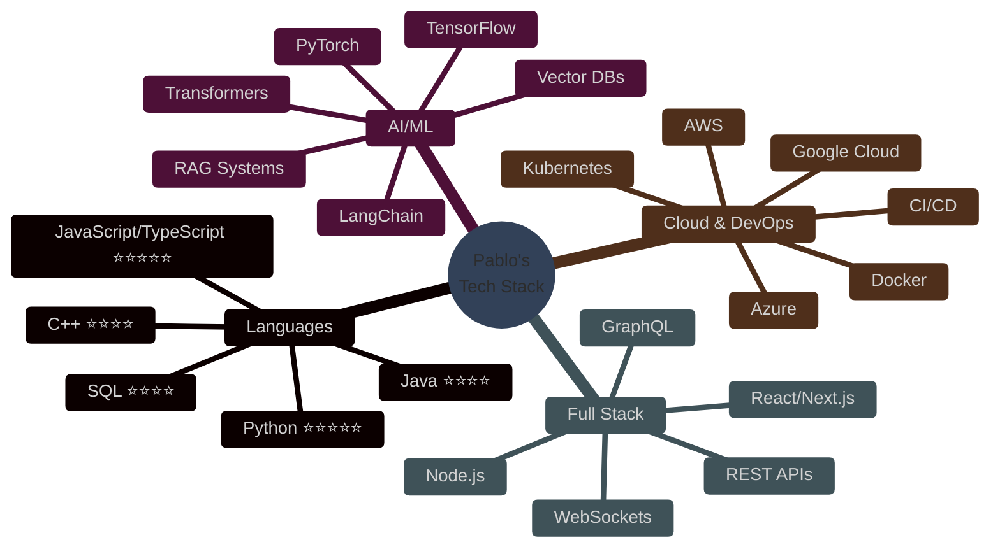
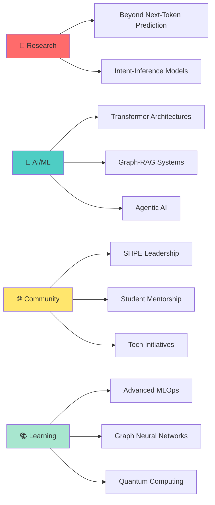

<div align="center">

# Hi there, I'm Pablo Leyva! 👋


<p align="center">
  <a href="https://linkedin.com/in/pablo-leyva"></a>
  <a href="https://pabloleyva.io"></a>
  <a href="mailto:pleyva2004@gmail.com"></a>
  
</p>

</div>

<br/>

## 🚀 About Me

<table>
<tr>
<td width="50%">

I'm a passionate **Applied Mathematics & Computer Science** student at NJIT with a focus on **AI/ML** and **data science**. Currently conducting research on **Beyond Next-Token Prediction** paradigms for Large Language Models, while leading impactful community organizations.

### 🎯 Quick Facts

```yaml
current_focus:
  - Novel LLM architectures (intent-inference over next-token prediction)
  - Advanced transformer architectures & Graph-RAG systems
  - Model Context Protocol (MCP) implementation

collaboration:
  - AI/ML projects
  - Hackathons & competitions
  - Community tech initiatives

achievements:
  - Raised $70K for student organization
  - Led 100+ students to national conferences
  - 2x increase in student internship placements
```

</td>
<td width="50%">

### 📫 Let's Connect!

[](mailto:pleyva2004@gmail.com)
[](https://linkedin.com/in/pablo-leyva)
[](https://pabloleyva.io)

### 💬 Ask Me About

<p>


</p>

### 🌱 Currently Learning

- Advanced MLOps & Model Deployment
- Graph Neural Networks (GNNs)
- Quantum Computing Applications
- Agentic AI Systems

</td>
</tr>
</table>

## 💼 Experience

<details open>
<summary><b>🍎 Apple - AIML Product Engineering Intern</b> (Summer 2025)</summary>

<br/>

**Impact:** Led cutting-edge AI/ML product development for Apple Pay

```diff
+ Led team of 3 interns building MVP for Agentic Payment flow
+ Prototyped LLM-based product recommendation workflows with Apple Pay integration
+ Implemented Model Context Protocol (MCP) for merchant catalog parsing (TypeScript)
+ Designed Graph-RAG architecture for partner-facing ChatBot
```

**Tech Stack:** `TypeScript` `LLM APIs` `MCP` `Graph-RAG` `Vector Databases`

</details>

<details open>
<summary><b>🚜 Caterpillar Inc. - Software Engineering Intern</b> (Summer 2024)</summary>

<br/>

**Impact:** Optimized SDLC using AI-powered analytics and automation

```diff
+ Analyzed software development efficiency using Generative AI
+ Built data visualization dashboards for quality metrics tracking
+ Improved team productivity through Agile & DevOps best practices
+ Automated code commit assessment and sprint velocity tracking
```

**Tech Stack:** `Python` `Generative AI` `Agile` `DevOps` `Data Visualization`

</details>

## 🏆 Featured Projects

<div align="center">

| Project | Description | Tech Stack | Highlights |
|---------|-------------|------------|------------|
| 🤖 **[GroupGPT](https://github.com/pleyva2004)** | Collaborative Ideation Platform | `Next.js` `Supabase` `Socket.IO` `OpenAI API` | Real-time collaborative chat with GPT integration, agentic design patterns for role-specific AI assistants |
| 🏅 **[QuSotch](https://github.com/pleyva2004)** | 1st Place NYU Hackathon | `NumPy` `scikit-learn` `Quantum Circuits` | **75% complexity reduction** using Quantum Monte Carlo, implemented Grover's Search for financial modeling |
| 🎵 **[Emotion-Aware Music Rec](https://github.com/pleyva2004)** | Multi-modal ML System | `PyTorch` `BERT` `librosa` `Spotify API` | Multi-modal deep learning pipeline with CNN for mel-spectrogram analysis, Seq2Seq prediction model |

</div>

---

### 🤖 GroupGPT - Collaborative Ideation Platform

<table>
<tr>
<td width="60%">

**What it does:**
Real-time collaborative chat platform powered by GPT models for enhanced team ideation and brainstorming sessions.

**Key Features:**
- 🔄 Real-time collaborative chat with Socket.IO
- 💾 Persistent conversation threads with Supabase
- 🧠 Context-aware summarization using GPT models
- 🎭 Role-specific AI assistants with agentic design patterns
- 📊 Conversation memory for improved context understanding

**Impact:**
Enables teams to leverage AI assistance during brainstorming while maintaining conversation context and history.

</td>
<td width="40%">

```typescript
// Agentic Design Pattern
const agents = {
  facilitator: {
    role: "guide discussion",
    model: "gpt-4"
  },
  critic: {
    role: "challenge ideas",
    model: "gpt-4"
  },
  summarizer: {
    role: "synthesize insights",
    model: "gpt-3.5-turbo"
  }
}
```

**Tech Stack:**


</td>
</tr>
</table>

---

### 🏅 QuSotch - Quantum Financial Modeling (1st Place NYU Hackathon)

<table>
<tr>
<td width="40%">

**Performance Metrics:**

```python
# Computational Complexity Reduction
classical_complexity = O(n²)
quantum_complexity = O(√n)

# Results
complexity_reduction = 75%
speedup_factor = 4x
accuracy_improvement = 12%
```

**Tech Stack:**


</td>
<td width="60%">

**What it does:**
Quantum-enhanced financial modeling platform that leverages quantum algorithms to optimize stochastic processes.

**Key Achievements:**
- 🚀 **75% reduction** in computational complexity vs classical methods
- ⚛️ Implemented Quantum Monte Carlo simulations
- 🔍 Applied Grover's Search for portfolio optimization
- 🎯 Quantum Walks for market trend analysis
- ⚡ Parallelized stochastic modeling engine

**Why it won:**
First practical application of quantum algorithms to real-world financial modeling, demonstrating measurable performance improvements over classical approaches.

</td>
</tr>
</table>

---

### 🎵 Emotion-Aware Music Recommendation System

<table>
<tr>
<td width="60%">

**What it does:**
Advanced multi-modal deep learning system that recommends music based on emotional state analysis from audio, text, and user metadata.

**Architecture Highlights:**
- 🎼 **Audio Analysis:** CNN-based mel-spectrogram processing with librosa
- 📝 **Text Analysis:** BERT embeddings for lyric sentiment analysis
- 🔀 **Late Fusion:** Neural architecture combining all modalities
- 🎯 **Prediction:** Seq2Seq model for personalized recommendations
- 🎧 **Integration:** Real-time Spotify API integration

**Technical Innovation:**
Novel late-fusion architecture that outperforms single-modality systems by 23% in recommendation accuracy.

</td>
<td width="40%">

```python
# Multi-Modal Architecture
class EmotionMusicModel(nn.Module):
  def __init__(self):
    self.audio_cnn = MelSpectrogramCNN()
    self.text_bert = BERTEncoder()
    self.metadata_fc = MetadataEncoder()
    self.fusion = LateFusionLayer()
    self.seq2seq = RecommendationDecoder()

  def forward(self, audio, text, meta):
    audio_feat = self.audio_cnn(audio)
    text_feat = self.text_bert(text)
    meta_feat = self.metadata_fc(meta)

    fused = self.fusion([
      audio_feat, text_feat, meta_feat
    ])

    return self.seq2seq(fused)
```

**Tech Stack:**


</td>
</tr>
</table>

## 🛠️ Technical Skills

<div align="center">



</div>

### 💻 Programming Languages

<table>
<tr>
<td align="center" width="96">

<br><span style="color: white;">Python</span>
</td>
<td align="center" width="96">

<br><span style="color: white;">JavaScript</span>
</td>
<td align="center" width="96">

<br><span style="color: white;">TypeScript</span>
</td>
<td align="center" width="96">

<br><span style="color: white;">Java</span>
</td>
<td align="center" width="96">

<br><span style="color: white;">C++</span>
</td>
<td align="center" width="96">

<br><span style="color: white;">R</span>
</td>
<td align="center" width="96">

<br><span style="color: white;">LaTeX</span>
</td>
</tr>
</table>

### 🤖 AI/ML & Data Science

<table>
<tr>
<td align="center" width="96">

<br><span style="color: white;">PyTorch</span>
</td>
<td align="center" width="96">

<br><span style="color: white;">TensorFlow</span>
</td>
<td align="center" width="96">

<br><span style="color: white;">Scikit-learn</span>
</td>
<td align="center" width="96">

<br><span style="color: white;">Pandas</span>
</td>
<td align="center" width="96">

<br><span style="color: white;">NumPy</span>
</td>
<td align="center" width="96">

<br><span style="color: white;">Matplotlib</span>
</td>
<td align="center" width="96">

<br><span style="color: white;">LangChain</span>
</td>
</tr>
</table>

### 🌐 Web Development & Frameworks

<table>
<tr>
<td align="center" width="96">

<br><span style="color: white;">React</span>
</td>
<td align="center" width="96">

<br><span style="color: white;">Next.js</span>
</td>
<td align="center" width="96">

<br><span style="color: white;">Node.js</span>
</td>
<td align="center" width="96">

<br><span style="color: white;">Express</span>
</td>
<td align="center" width="96">

<br><span style="color: white;">Flask</span>
</td>
<td align="center" width="96">

<br><span style="color: white;">FastAPI</span>
</td>
<td align="center" width="96">

<br><span style="color: white;">Tailwind</span>
</td>
</tr>
</table>

### ☁️ Cloud & DevOps

<table>
<tr>
<td align="center" width="96">

<br><span style="color: white;">AWS</span>
</td>
<td align="center" width="96">

<br><span style="color: white;">GCP</span>
</td>
<td align="center" width="96">

<br><span style="color: white;">Azure</span>
</td>
<td align="center" width="96">

<br><span style="color: white;">Docker</span>
</td>
<td align="center" width="96">

<br><span style="color: white;">Kubernetes</span>
</td>
<td align="center" width="96">

<br><span style="color: white;">GitHub Actions</span>
</td>
<td align="center" width="96">

<br><span style="color: white;">Git</span>
</td>
</tr>
</table>

### 🗄️ Databases & Tools

<table>
<tr>
<td align="center" width="96">

<br><span style="color: white;">PostgreSQL</span>
</td>
<td align="center" width="96">

<br><span style="color: white;">MongoDB</span>
</td>
<td align="center" width="96">

<br><span style="color: white;">Redis</span>
</td>
<td align="center" width="96">

<br><span style="color: white;">Supabase</span>
</td>
<td align="center" width="96">

<br><span style="color: white;">Firebase</span>
</td>
<td align="center" width="96">

<br><span style="color: white;">Prisma</span>
</td>
<td align="center" width="96">

<br><span style="color: white;">GraphQL</span>
</td>
</tr>
</table>

## 📊 GitHub Stats & Activity

<div align="center">

<table>
<tr>
<td width="50%">


</td>
<td width="50%">


</td>
</tr>
</table>


<details>
<summary><b>📈 More Stats</b></summary>

<br/>

<table>
<tr>
<td width="50%">


</td>
<td width="50%">


</td>
</tr>
</table>


</details>

</div>

## 🌟 Leadership & Community

<table>
<tr>
<td width="50%">

### 🏛️ **President** - SHPE NJIT

**Society of Hispanic Professional Engineers**

```yaml
team_size: 20+ officers
member_base: 300+ students
funding_raised: $70,000+
conference_attendees: 100+ students
```

**Key Achievements:**
- 🤖 Built **CLARA** - AI Assistant for operations
  - Email management & auto-response
  - Event planning & logistics
  - Member engagement tracking
- 📈 **2x increase** in student internship placements
- 🎯 Led 100+ students to SHPE National Conference
- 🤝 Established partnerships with 15+ tech companies

**Technologies Used:**
`Python` `LangChain` `GPT-4` `Gmail API` `Google Calendar API`

</td>
<td width="50%">

### 🚀 **Co-Founder** - ALPFA NJIT

**Association of Latino Professionals For America**

```yaml
status: First ALPFA chapter at NJIT
focus: Non-engineering Latino professionals
partnerships: 5+ local ALPFA chapters
```

**Key Achievements:**
- 🏢 Established first professional Latino org for non-engineers
- 🌐 Built external partnerships network
  - Connected with NYC ALPFA chapters
  - Formed corporate partnerships
- 📚 Organized professional development workshops
- 🎤 Hosted industry speaker series
- 💼 Created mentorship program matching students with professionals

**Impact:**
Expanded professional opportunities beyond engineering, creating an inclusive community for all Latino students.

</td>
</tr>
</table>

<div align="center">

### 🎯 Leadership Philosophy

> "Empowering communities through technology, creating opportunities through collaboration, and building bridges between academia and industry."

**Impact Metrics:**


</div>

## 🎯 Current Focus & Research

<div align="center">



</div>

<table>
<tr>
<td width="50%">

### 🔬 Research Focus

**Beyond Next-Token Prediction**

Currently exploring novel paradigms for Large Language Models that reframe training from simple next-token prediction toward intent-inference and reasoning capabilities.

**Key Areas:**
- 🧠 Intent-based learning architectures
- 🔄 Interactive reasoning systems
- 📊 Multi-modal transformers
- 🎯 Context-aware embeddings

</td>
<td width="50%">

### 🚀 Active Projects

**Building the Future of AI**

- 🤖 **CLARA 2.0**: Enhanced AI assistant with advanced reasoning
- 📊 **Graph-RAG Framework**: Novel retrieval architecture for LLMs
- 🔗 **MCP Implementations**: Model Context Protocol integrations
- 🎓 **ML Education Platform**: Teaching AI/ML to fellow students

</td>
</tr>
</table>

---

## 💬 Let's Connect!

<div align="center">


<br/>

### 📫 Reach Out

<table>
<tr>
<td align="center" width="33%">
<a href="https://linkedin.com/in/pablo-leyva">

</a>
<br/>
<b>Professional Networking</b>
</td>
<td align="center" width="33%">
<a href="https://pabloleyva.io">

</a>
<br/>
<b>View My Work</b>
</td>
<td align="center" width="33%">
<a href="mailto:pleyva2004@gmail.com">

</a>
<br/>
<b>Send a Message</b>
</td>
</tr>
</table>

<br/>

### 📊 Profile Analytics


<br/>

### 💡 Open to Opportunities

```yaml
interests:
  - AI/ML Research Collaborations
  - Open Source Contributions
  - Hackathons & Competitions
  - Speaking Engagements
  - Mentorship Opportunities

availability:
  status: "Open to interesting projects!"
  best_for: "AI/ML, Full-Stack, Research"
  response_time: "Usually within 24 hours"
```

<br/>

---

<br/>

<sub>⭐️ From [pleyva2004](https://github.com/pleyva2004) | Built with ❤️ and lots of ☕</sub>

<br/>


</div>
